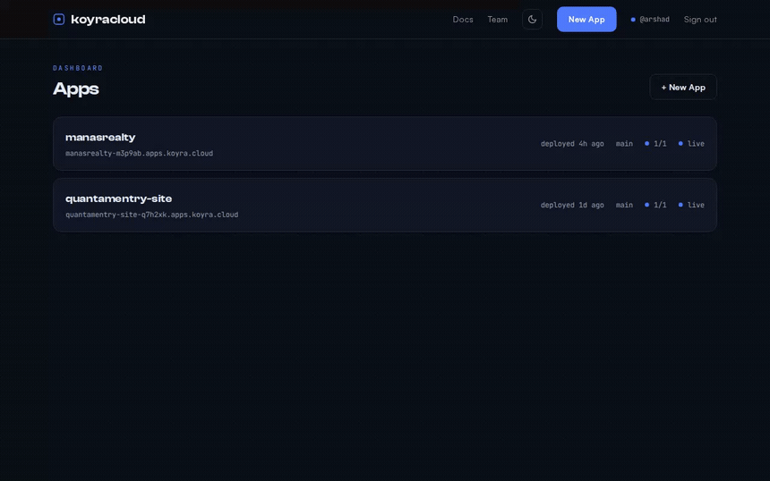
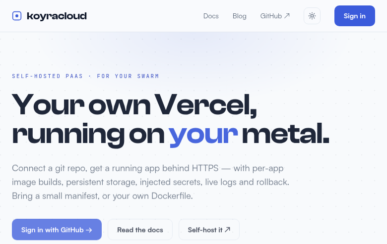

<div align="center">

# koyracloud

**Your own Vercel — self-hosted on your Docker Swarm.**

Connect a git repo and koyracloud builds it into a container image, pushes it to a
built-in registry, and runs it behind HTTPS — with persistent storage, injected
secrets, live deploy logs, custom domains, push-to-deploy and rollback. Bring a
small manifest **or your own `Dockerfile`**; apps run on any node, pinned to none by
default (opt-in pinning is available for stateful apps).



<picture>
  <source media="(prefers-color-scheme: dark)" srcset="hero-dark.png" />
  
</picture>

[](LICENSE)


</div>

---

## What it is

koyracloud turns a Docker Swarm into a single-operator Platform-as-a-Service. It's
the "connect a repo → it deploys" experience of Render/Vercel, scoped to **trusted
code and internal apps** — your homelab, your clients' apps, your side projects.

Each deploy **builds a per-app container image** (from your manifest's build steps,
or your repo's own `Dockerfile`), **pushes it to an internal registry** koyracloud
runs, and deploys a Swarm service from it. The build runs on local disk and the app
runs from the image — **never reading code over NFS** — so any node can pull and run
(and reschedule) the app. NFS is used only for persisted data.

## The manifest

Describe build & run in a `.paas/app.yaml` committed to your repo:

```yaml
name: my-app
runtime: python+node          # python | node | python+node | static | dockerfile
subdomain: my-app.apps.example.com
port: 8000
build:
  - pip install -r requirements.txt
  - bash -c "cd web && npm ci && npm run build"
predeploy:
  - alembic upgrade head       # runs every start, before the app
start: uvicorn app.main:app --host 0.0.0.0 --port 8000
persist: [data]                # survives redeploys (NFS-backed)
healthcheck: /health
secrets: [SECRET_KEY]          # values set in the UI, injected at build + run
```

**Bring your own Dockerfile.** Set `runtime: dockerfile` (or `dockerfile: path/to/Dockerfile`)
and koyracloud builds your image as-is and runs it as a managed service — you still
get domains, env/secrets, and the dashboard:

```yaml
name: my-app
runtime: dockerfile
port: 8000
healthcheck: /health
secrets: [DATABASE_URL]
```

Build-time-inlined frameworks (`NEXT_PUBLIC_*`, `VITE_*`) get their values as
**build args**, so the right config is baked into client bundles instead of
`undefined`. Secrets are injected at **run** time only (never baked into image layers).

Full reference: the **Docs** in-app (`/docs`) or [`examples/`](examples/).

## Background workers, cron & Redis

The same repo + the same built image can also run **background workers** (always-on,
no HTTP port), **cron jobs** (run to completion on a schedule), and reach a **shared
Redis** bus — all declared in the manifest:

```yaml
redis: true                      # provision a scoped Redis, inject REDIS_URL

workers:                         # always-on processes (queue consumers, bots…)
  - name: events
    start: python -m app.worker
    replicas: 1                  # optional (default 1); cpu/memory optional too

cron:                            # 5-field schedules, UTC
  - name: nightly
    schedule: "0 2 * * *"
    command: python -m app.jobs.nightly
```

- **Workers** are extra Swarm services off the one image — same env, secrets and
  `REDIS_URL`, no router, no healthcheck. They don't run the web's `predeploy`.
- **Cron** jobs are launched by the control plane as Swarm run-to-completion jobs from
  the app's current live image, with per-run status + logs and a **Run now** button in
  the dashboard. No catch-up: a job overdue after downtime fires once, not per missed slot.
- **Redis** is one koyracloud-owned instance shared by all apps but **isolated per app
  by an ACL user**: you may only touch keys and pub/sub channels prefixed `<app-name>:`.
  Namespace your keys that way (e.g. `my-app:jobs`) — other names are rejected. The
  instance runs `noeviction`, so it back-pressures with write errors rather than silently
  dropping another app's queued messages.

The **Background** tab on each app shows worker status + logs, cron schedules + run
history, and the Redis status.

Full reference: the **Docs** in-app (`/docs`) or [`examples/`](examples/).

## How it works

```
repo (.paas/app.yaml or Dockerfile)
   │  control plane clones → LOCAL build dir @ commit
   ▼
docker build  →  per-app image   (your Dockerfile or a generated one; app env as build args)
   ▼
docker push   →  internal registry   (a swarm service; 127.0.0.1:5000 over the ingress mesh)
   ▼
docker stack deploy   →  service   (Traefik labels, runtime secrets, NFS persist volumes)
   ▼
swarm pulls the image + runs the app on any node   ·   https://<host>
```

The control plane is a FastAPI + React app running as one Swarm service, driving the
cluster through the mounted docker socket. It builds images on local disk (fast,
layer-cached) instead of on NFS, and the running container serves from the image —
so apps don't depend on the build node and aren't pinned anywhere by default (stateful
apps can opt in to pinning — see [ARCHITECTURE.md](docs/ARCHITECTURE.md)).

## Features

- **Bring a repo or a Dockerfile** — generated buildpack image (`python:3.12` +
  `node:22`) or your repo's own `Dockerfile`, built locally and layer-cached.
- **Built-in registry, run anywhere** — images are pushed to an internal `registry:2`
  service and pulled by Swarm on whichever node runs the app. Nothing is pinned by
  default; registry storage and `persist:` data use Docker NFS-driver volumes so they
  work on any node. Stateful apps with node-local data can opt in to pinning instead.
- **Auto-TLS subdomains + custom domains** — platform subdomains get Traefik /
  Let's Encrypt; users' own domains are registered as **Cloudflare for SaaS** custom
  hostnames (the edge mints + renews the cert, so the user just adds two CNAMEs at
  their registrar — Vercel-style).
- **Push-to-deploy** — a GitHub webhook deploys on `push`, or on a successful
  `workflow_run` so repos with CI deploy only after it passes.
- **Secrets encrypted at rest** (Fernet), injected at run time.
- **Live build/deploy logs** (SSE), deploy history, one-click rollback.
- **Persistent storage** via manifest `persist:` dirs.
- **Background workers, cron & a Redis bus** — declare `workers:`, `cron:` and
  `redis: true` in the manifest: always-on workers, scheduled jobs (with run history),
  and a per-app-isolated Redis to pass events between them — all from the same repo.
  See the *Background workers, cron & Redis* section below.
- **Metrics & monitoring** — the control plane exposes Prometheus `/metrics` (per-app
  end-to-end reachability) plus an alert group + Grafana dashboard
  ([`docs/MONITORING.md`](docs/MONITORING.md)).
- **GitHub OAuth** behind a login allowlist — single-operator by design. Logins in
  `KOYRA_ALLOWED_LOGINS` are admins and see every app; people invited from the Team page
  are scoped members who only see the apps they own.

## Set up your own koyracloud

**What you need first:**

- A **Docker Swarm** (one or more nodes) with **Traefik** running as the HTTPS edge
  (a `websecure` entrypoint + an ACME/Let's Encrypt cert resolver), on an external
  overlay network — `traefik_public` by convention.
- An **NFS export** the nodes can reach (for persistent app data + the image registry).
- A **domain** for your apps (e.g. `apps.example.com`) with a wildcard DNS record, and a
  **GitHub OAuth app** so you can sign in.

**Set it up:**

```bash
git clone https://github.com/hikmahtech/koyracloud.git
cd koyracloud

# Fill in your instance config (domain, NFS server, GitHub login, host):
cp deploy/koyracloud.env.example deploy/koyracloud.env
$EDITOR deploy/koyracloud.env

# Guided installer: creates the network + secrets, builds the base image, deploys.
DOCKER_CONTEXT=<your-swarm-context> ./deploy/install.sh
```

Then open `https://<your KOYRA_HOST>`, sign in with GitHub, click **New App**, paste a
repo URL, and **Deploy**. Your app comes up at `<name>-<token>.<your apps domain>`.

> **New to Docker Swarm + Traefik?** The full walkthrough — from bare machines to your
> first deployed app, including the swarm, Traefik edge, NFS and DNS — is in
> **[`docs/SELF-HOST-TUTORIAL.md`](docs/SELF-HOST-TUTORIAL.md)**. Prefer manual steps and
> every secret command spelled out? **[`deploy/README.md`](deploy/README.md)**.

For the design and the reasoning behind the build/registry/no-pinning choices, see
**[`docs/ARCHITECTURE.md`](docs/ARCHITECTURE.md)**. Running a locked-down setup and want
to know exactly what access the control plane needs (Docker socket, NFS, registry,
GitHub OAuth scopes)? See **[`docs/PERMISSIONS.md`](docs/PERMISSIONS.md)**. Moving an
existing Next.js app off Vercel? The field-tested playbook (strategies, Dockerfiles,
env/secrets, the apex problem and its four solutions, email preservation) is in
**[`docs/MIGRATING-FROM-VERCEL.md`](docs/MIGRATING-FROM-VERCEL.md)**.

## Local development

```bash
# control plane (SQLite, OAuth bypassed; builds fall back to bind mounts)
cd control-plane
KOYRA_DEV_LOGIN=you \
KOYRA_SECRET_KEY="$(python -c 'from cryptography.fernet import Fernet;print(Fernet.generate_key().decode())')" \
  uv run uvicorn koyracloud.main:app --reload

# UI (proxies /api to :8000)
cd web && npm install && npm run dev
```

## Tests

```bash
cd control-plane  && uv run --with-editable . --with pytest pytest  # control plane
```

## Project layout

```
runtime-image/   the base buildpack image: Dockerfile + koyra_static.py (the FROM base for generated app images)
control-plane/   FastAPI + SQLAlchemy control plane (build/registry, apps, deploys, domains, secrets, OAuth)
web/             React + Vite + Tailwind + TanStack Query (landing, docs, dashboard)
deploy/          swarm stack (control plane + registry) + deploy script + runbook
examples/        sample .paas/app.yaml manifests
docs/            architecture + design decisions
```

## Non-goals

Multi-tenant isolation/sandboxing of untrusted code, autoscaling, preview-per-PR
environments, managed databases, billing. It's a single-operator, trusted-code,
internal-apps platform — kept small on purpose.

## Built by

koyracloud is built and maintained by **[Hikmah Technologies](https://hikmahtechnologies.com)** and is running in production for clients including [ansaar.in](https://ansaar.in), [domainposture.com](https://domainposture.com), [quantamentry.com](https://quantamentry.com), [manasrealty.com](https://manasrealty.com), and [vcsolutions.co.in](https://vcsolutions.co.in).

## Contributing

Issues and PRs welcome — see [CONTRIBUTING.md](CONTRIBUTING.md) and
[SECURITY.md](SECURITY.md). All tests must pass.

## License

koyracloud is licensed under the **GNU AGPL-3.0** (see [LICENSE](LICENSE)). You may
self-host and modify it freely; if you run a modified version as a network service,
you must offer your source under the same terms.

**Commercial licensing.** The AGPL's network-copyleft is not suitable for every
business. A commercial license (no copyleft obligations) is available from the
copyright holder — see [LICENSING.md](LICENSING.md).

© [Hikmah Technologies](https://hikmahtechnologies.com) / Arshad Ansari.
